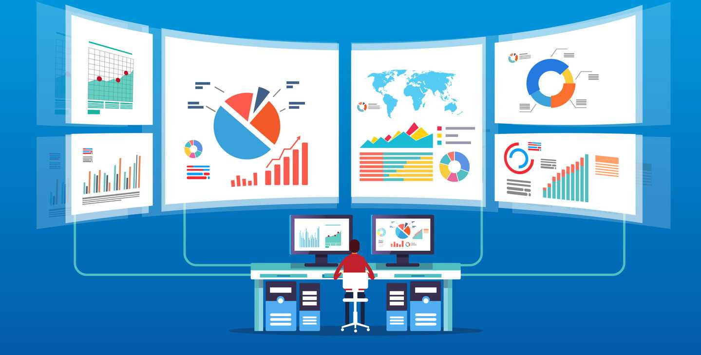

- 👋 Hi, I’m Karthik V
- 👀 I’m interested in Data Science,Machine Learning, Internet of Things
- 🌱 I’m currently learning and Research...
- 💞️ I’m looking to collaborate on ...
- 📫reach me ...svkarthik86@gmail.com 
what-is-data-analyst.jpg

<!---
svkarthik86/svkarthik86 is a ✨ special ✨ repository because its `README.md` (this file) appears on your GitHub profile.
You can click the Preview link to take a look at your changes.
--->

		
# Welcome to my profile webpage!

My name is V. Karthik, and I am a highly qualified and experienced professional in the field of Computer Science and Engineering. I hold a B.Tech(Information Technology)., M.E.(Computer Science), and (pursuing PhD) in Computer Science and Engineering, and I have over 15 years of experience in various roles such as Lecturer ,Asst. Professor,Data Analytics / Data Science Trainer in reputed colleges and industries.

## Objective

My objective is to strive for academic excellence and impart quality education with an emphasis on Computer Science & Engineering with Specialization of Data Science. I believe in inculcating the habit of executing effective implementation and rectification of Data Science problems in the minds of all concerned, which they can apply in their professional life in the future.

## Skills

I have expertise in various skills such as:
|   S.No             |  Skills
| -----------        | -----------   |
| 1                  | Python        |
| 2		     | R Programming  |
| 3                  | Advance Python        |
| 4		     | Machine Learning Algorithms  |		
| 5                  | Excel VBA       |
| 6		     | SAS Programming |		
| 7                  | Tableau        |
| 8		     | SQL- MySQL / NoSQL - MongoDB |		
| 9                  | Cloud Technology Azure/AWS    |
| 10                 | Generative AI, LLM, LangChain, Prompt Engineering, ChatGPT, PaLM |

	

## Subjects Handled

I have also handled various subjects such as:

- Problem Solving and Python Programming
- Fundamentals of Computing & Programming
- Object-Oriented Programming
- Data Analytics Using Python, R, SAS, and Excel
- Cloud Computing
- Machine Learning Algorithms
- Internet of Things and Securities
- Python for Data Science

## Co-curricular Activities

Apart from my professional experience, I have also participated in various co-curricular activities such as:

- Publishing papers in international and national conferences
- Attending workshops, FDPs, and seminars
- Completing online courses in various fields

## Software and Programming Languages

I am proficient in various software and programming languages such as:

- C
- C++
- Python
- Advance Python(Numpy,Pandas,Scipy,Matplotlib,Seaborn)
- Machine Learning Framework (Sklearn,TensorFlow,Kearas)
- R-Programming(tidyverse)
- Java
- HTML5.0
- CSS
- Java Script
- VB Script
- MySQL
- NoSQL: Mango DB
- and more

## Personal Information

I am a citizen of India and fluent in English and Tamil.

## Contact Information

Thank you for visiting my profile webpage. If you have any queries or would like to connect with me, please feel free to contact me at svkarthik86@gmail.com 
#### LinkedIn - www.linkedin.com/in/svkarthik86

